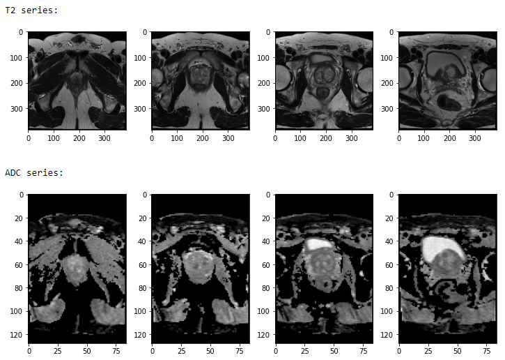
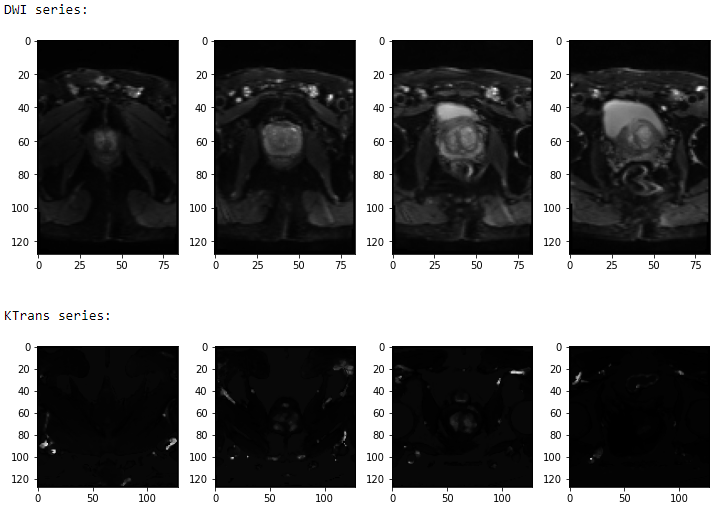
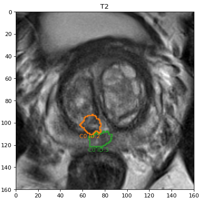
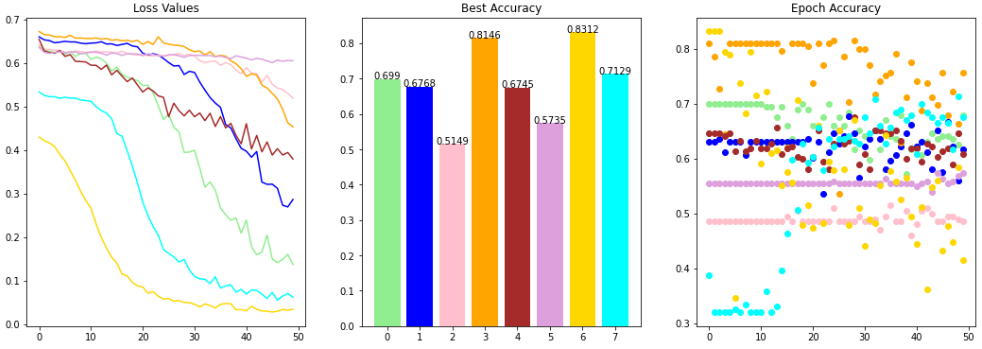
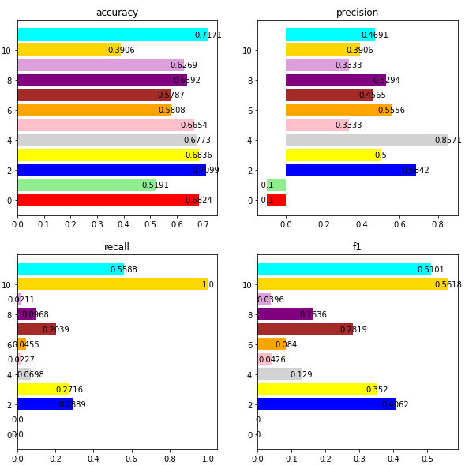

# 3D Prostate Cancer Classifier
The purpose of this project is to develop a **Convolutional Neural Network** capable to determine whether the prostate 
lesion is  benign or malign.

## Set up
The [`constants.py`](constants.py) file contains the generalised variables that will be used throughout the notebooks in 
this repository. It is advisable to update this Python file before you start running the notebooks.

In order to create the virtual environment, the following steps must be followed. Download and install 
<a href="https://www.anaconda.com/products/distribution">Anaconda</a>, then open Anaconda
Prompt in order to create your virtual environment. Create a virtual environment using the commands below.
```bash
conda create -n pca39 python=3.9
conda activate pca39
```
Install <a href="https://pytorch.org/">PyTorch</a> in your environment, then navigate to the repository and run the
[`requirements.txt`](requirements.txt) file:
```bash
pip install -r requirements.txt
```
Launch Jupyter Notebook with the following command:
```bash
jupyter notebook
```

## Dataset
The training and testing data used for this project was provided by the PROSTATEx Challenges:
<a href="https://wiki.cancerimagingarchive.net/pages/viewpage.action?pageId=23691656">SPIE-AAPM-NCI PROSTATEx Challenges
(PROSTATEx)</a>. Due to the fact that only the training set provides a ground truth, the dataset was randomly split in 
order to provide a training and a testing dataset (see **Detailed Description**).

For training, there were provided **T2-weighted transversal** images, as well as **ADC**, **DWI**, and **KTrans**. All DICOM files 
need to be converted to NIFTI files using <a href='https://www.nitrc.org/projects/mricrogl/'>MRIcoGL</a> [1]. Then the 
[`Data_preparation`](01_Data_preparation.ipynb) notebook will sort out the T2-weighted transversal images as well as 
convert the KTrans files (*.mhd) into NIFTI format. Also, because the DWI files have multiple contrasts, they were split
into multiple files with one type of contrast each. Through the [`Data_preparation`](01_Data_preparation.ipynb) notebook, 
a pickle file will be created, that will contain the lesion information for each patient, based on the **Findings.csv** 
file, as well as the locations to each patient's T2-weighted, ADC, DWI, and KTrans files.

An example of how the data has been sorted and refined can be seen through running the 
[`Visualize_data`](02_Visualize_data.ipynb) notebook.

#### Series of T2-weighted, ADC, DWI, and KTrans images



### 3D Plotting using plot_lib
In order to visualize the **multiparametric Magnetic Resonance Images** (mpMRI) lesions, the 
[`Visualize_data`](02_Visualize_data.ipynb) notebook uses the [`plot_lib`](https://github.com/OscarPellicer/plot_lib) 
repository [2]. It can be cloned using the following command: 
```bash
git clone https://github.com/OscarPellicer/plot_lib.git
```

### Additional data used for plotting
[`ProstateX_plotting`](ProstateX_plotting) contains generated data from running the 
<a href='https://github.com/OscarPellicer/prostate_lesion_detection/blob/main/ProstateX%20preprocessing.ipynb'>ProstateX 
preprocessing</a>
notebook [2]. The data is used for visualising the lesions in the [`Visualize_data`](02_Visualize_data.ipynb) notebook.

#### Example of lesion plotting on a T2-weighted image, using plot_lib and ProstateX_plotting


## MONAI
<a href='https://monai.io/'>MONAI (Medical Open Network for Artificial Intelligence)</a> is a freely available, 
community-supported, PyTorch-based framework for deep learning in healthcare imaging. It provides domain-optimized 
foundational capabilities for developing healthcare imaging training workflows in a native PyTorch paradigm. [3]

## Training
The [`Train_and_Evaluate`](03_Train_and_Evaluate.ipynb) notebook will train the model. It is based on the MONAI 3D 
classification tutorial. The model uses a DenseNet-121 architecture, along with Binary Cross Entropy loss function, as 
well as an Adam optimizer.

## Getting the results
In order to visualize the KPI values and the evaluation metrics as plots, run the notebooks found in the 
[`results_notebooks`](results_notebooks) folder:
- [`results_notebooks/01_Get_result_data.ipynb`](results_notebooks/01_Get_result_data.ipynb);
- [`results_notebooks/02_Plot_results_data.ipynb`](results_notebooks/02_Plot_results_data.ipynb).

An example of the resulting plots is shown below.

#### Resulted internal KPI plots example


#### Resulted metrics plots example


## Bibliography
[1] Hugegene, <a href='https://towardsdatascience.com/3d-cnn-classification-of-prostate-tumour-on-multi-parametric-mri-sequences-prostatex-2-cced525394bb'>
3D CNN Classification of Prostate Cancer on PROSTATEx-2</a>. 3D CNN on Multi-Parametric MRI Sequences. 2019.

[2] Oscar J. Pellicer-Valero, José L. Marenco Jiménez, Victor Gonzalez-Perez, Juan Luis Casanova Ramón-Borja, Isabel 
Martín García, María Barrios Benito, Paula Pelechano Gómez, José Rubio-Briones, María José Rupérez, José D. 
Martín-Guerrero, <a href='https://arxiv.org/abs/2103.12650'>Deep Learning for fully automatic detection, segmentation, 
and Gleason Grade estimation of prostate cancer in multiparametric Magnetic Resonance Images</a>. Scientific Reports. 
February, 2022.

[3] <a href='https://monai.io/'>MONAI - Medical Open Network for Artificial Intelligence</a>
